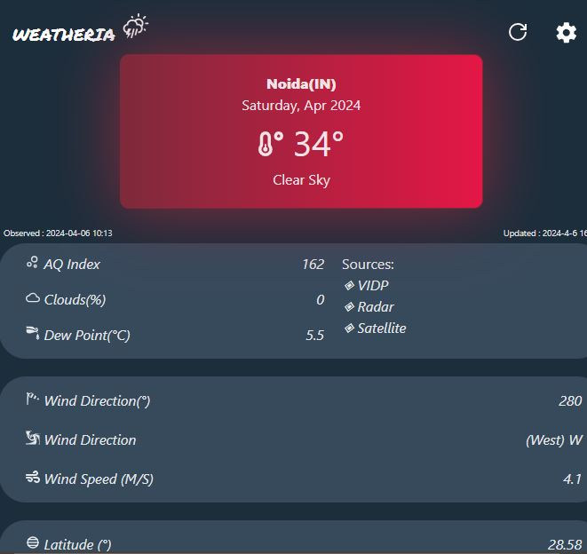

# Weatheria - Real-time Weather App

Weatheria is an app I developed using vite(react). It uses data from weatherBit api. Latest info is provided by this app about the current weather conditions.

Visit my App - [Weatheria](https://myweatheria.netlify.app/)

Technologies used:

- HTML
- CSS
- JS
- React
- Vite

This app uses the weatherbit api with 21 days free plan. If you have a better option (completely free) please inform me or contribute on this repo.

## How To Run The Project

- Fork the repo and clone it.
- Install dependencies using node(npm) or yarn.
  - To install dependencies use..
    `> npm install # for npm installation`
    `> yarn # for yarn installation`
- Run it using ...
  `> npm run dev #YARN`
  `> yarn run dev #YARN`

- The project will start on localhost:3000, You can now make changes to the project or contribute to it however you like.

##

#

## Me

Hey there! My name is Mohd Saad. I am an aspiring Web Developer and currently a Btech student. If you like this project then you can star this repo and if you want to work in a team on any project, contact me via mail or on my [LinkedIn](https://www.linkedin.com/in/webdevmsaad/) profile.
